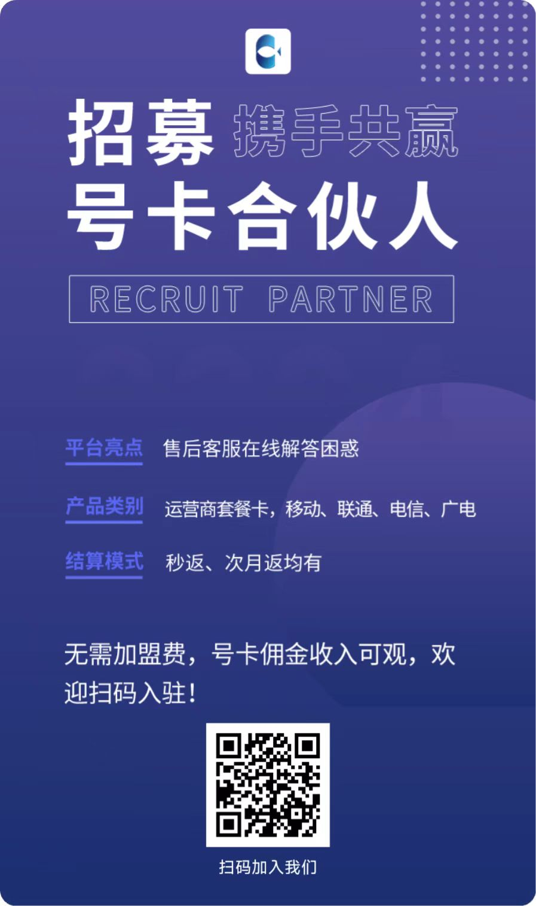

# 172号卡分销系统代理加盟指南

## 为什么选择172号卡分销系统?

1. 丰富的产品线:我们提供多种运营商的流量卡套餐,满足不同客户需求。
2. 高额佣金:我们的佣金比例具有竞争力,让您轻松赚取可观收益。
3. 便捷的管理系统:我们的后台管理系统简单易用,帮助您高效管理业务。
4. 专业的技术支持:我们有专业的客服团队,为您提供全方位支持。

## 如何成为172号卡分销系统代理?

1. 注册账号:访问我们的官网,填写相关信息完成注册。
2. 实名认证:上传身份证等资料,通过实名认证。
3. 选择代理等级:根据您的业务规模选择合适的代理等级。
4. 签署协议:仔细阅读并签署电子代理协议。
5. 开始运营:审核通过后即可开始您的代理业务!

## 如何注册172号卡分销系统账号?

### 👤 个人注册

1. [点击注册](https://haoka.lot-ml.com/plugregper.html?agentid=90925)172号卡分销系统注册链接: 
2. 在页面上填写登入账号、手机号、验证码等必要信息
3. 设置安全的登录密码
4. 仔细阅读并同意用户协议
5. 点击"注册"按钮提交申请
6. 等待系统审核,审核通过后即可成为代理

### 👀 手机扫码注册

### 🏢 企业注册

   
1. [点击注册](https://haoka.lot-ml.com/plugregcom.html?agentid=90925)按钮
2. 输入账号登入密码
3. 填写企业法人
4. 公司名称、统一信用代码和线上平台
5. 在选择企业的类型
6. 输入手机号和验证码
7. 提交注册申请
### 👀 手机扫码注册

### 🔐 登入系统

完成注册后,您可以通过以下链接登入172号卡分销系统:

[点击此处登入系统](https://haoka.lot-ml.com/login.html)

请妥善保管您的账号和密码,如有任何问题,请联系客服获取帮助。

## 代理权益

1. 专属后台:获得独立的代理后台,轻松管理订单和佣金。
2. 培训支持:我们提供产品知识和销售技巧培训,助您快速上手。
3. 营销物料:获得专业设计的宣传海报、传单等营销物料。
4. 客户转介:有机会获得平台分配的优质客户资源。

1

# 致分销商的一封信 📝

亲爱的分销商朋友们：

## 为什么选择这个行业？💥 

1. 📱 手机已成为生活必需品，流量自然而然成为手机的动力。因此，流量卡正适合这样一个风口。

2. 🌐 流量卡适合广大用户群体，不仅仅是学生，还包括外出工作、旅游的人群，都对其有极大的需求。

3. ♻️ 流量卡是一款循环经济产品，价格适合大众群体使用，都在可接受的经济范围之内。

4. 💰 属于低成本高回报的产品，适合所有人去做的一个项目。

5. 🌟 这就是我一直在做它的几大原因。

## 业务简述

号卡分销是一种将电话号码卡（SIM卡）或其他类型的号码卡进行分销和销售的业务模式。这些号卡通常用于移动通信服务，可以用于手机通话、短信和数据使用。

### 号卡分销主要涉及以下几个方面：

1. 📦 采购号卡：从电信运营商或其他供应商处采购大量的号卡，包括预付费卡和后付费卡。

2. 🏪 渠道销售：通过线下门店、电商平台、代理商、分销商等多种渠道进行销售。

3. 📣 市场推广：进行广告宣传、促销活动、合作伙伴推广等，吸引潜在用户。

4. 🛠️ 售后服务：提供激活号卡、解决用户问题、处理退换货等服务。

号卡分销是一个常见的业务模式，它不仅为用户提供便利，也为分销商创造收益，同时促进了与供应商的合作关系。

## 我们提供的平台优势 🚀

1. 🤝 运营商直签合作：我们与中国移动、中国联通、中国电信、中国广电等各大运营商直接合作，确保套餐最正规、最优惠。

2. 🎁 丰富的产品线：各类号卡产品应有尽有，包括手机卡、上网卡、电话卡、流量卡等。运营商会及时更新最新优惠套餐！

3. 💰 高额佣金政策：得益于与运营商的直签合作，我们始终保持高佣政策。佣金结算快速、稳定，充分回报您的每一份努力。

4. 🖥️ 完善的分销管理体系：包括订单管理、订单查询、商品管理、提现管理、佣金明细等功能，让您的分销业务畅通无阻。

让我们携手并进，共同致力于5G通讯服务，为用户提供高品质的服务和产品。一起为自己的财富梦想而奋斗吧！💪

## 注意事项

1. 严格遵守平台规则,禁止虚假宣传和恶意竞争。
2. 保护客户隐私,不得泄露客户信息。
3. 及时处理客户反馈,提供优质售后服务。
4. 定期参与平台组织的培训,提升业务能力。

加入172号卡分销系统,让我们携手共创辉煌!如有任何疑问,欢迎随时联系我们的客服团队。

# 联系我们

  

    
    
关注我们

  

  

    
    
扫码注册

  

  

    
    
在线领卡

  

