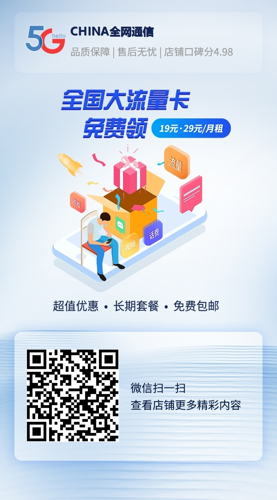

# 172号卡免费领取流量卡详细教程

## 步骤1: 访问领卡链接

点击以下链接进入领卡页面:
- [免费领卡](https://172.lot-ml.com/ProductEn/Index/1a654e0b341cadd2)
  

## 或者手机扫码

## 步骤2: 选择套餐

在页面上浏览可用的套餐选项,根据您的需求选择合适的套餐。

## 步骤3: 填写信息

仔细填写以下信息:
- 姓名
- 身份证号
- 手机号
- 收货地址

请确保所有信息准确无误。

## 步骤4: 确认订单

检查您填写的信息和选择的套餐是否正确,然后点击确认订单。

## 步骤5: 等待发货

订单确认后,请耐心等待发货。正常情况下1-3个工作日内发货。

## 步骤6: 收货并激活

收到SIM卡后,请按照随卡附带的说明进行激活操作。

## 注意事项

- 请务必在收货地址附近激活SIM卡
- 激活时请严格按照要求操作
- 如遇到任何问题,请及时联系客服

领取成功后,您将享受到172号卡提供的优质服务和超值套餐。如需更多帮助,欢迎随时咨询我们的客服团队。

## 领卡全攻略:常见问题解答

## 一、领卡前的疑问解惑

### 1. 我们的流量卡是否正规?
我们的产品均由四大运营商统一审核发货,可在官方APP查询套餐信息。与营业厅办理的卡完全一致,平台不接触卡片,由运营商安排快递配送及激活。

### 2. 快递激活和自主激活有何区别?
- 快递激活:运营商指派快递员携带开卡器当面激活,您只需出示身份证。
- 自主激活:收到快递后,按包裹内激活流程操作。
不同省份规则有异,但均为正规实名认证,激活方式不可指定。

### 3. 首充是什么?后续如何充值?
- 首充:参与首充活动才能享受优惠月租,须在专属链接或快递员处完成。
- 后续充值:可在任意官方渠道进行。

### 4. 网速如何?
与营业厅办理的卡一致。支持5G网络的手机可使用5G,具体速度取决于当地基站覆盖情况。

### 5. 如何确认订单成功?
查单链接显示以下状态之一即为成功:
- 开卡中:订单已提交运营商审核
- 已发货:产生物流单号

### 6. 年龄限制和不发货地区问题
- 年龄限制:各省份不同产品有不同要求,可更换适合年龄的产品。
- 不发货地区:可选择支持当前地址发货的产品。注意:激活后全国可用。

### 7. 发货时间
下单后48小时内审核发货。

### 8. 可以办理副卡吗?
所有卡均不可办理副卡。

### 9. 流量使用会限速吗?
正常使用套餐内流量不限速。

### 10. 首月按天折算是什么意思?
电信卡首月免月租,套餐内流量和通话分钟按剩余天数折算到账。

## 二、领卡过程中的注意事项

### 1. 激活后无法使用怎么办?
提交激活后需等待运营商审核,通过后会收到短信通知。一般需10-30分钟,晚间激活次日处理。如仍无法使用,可尝试重启手机或重新插卡。

### 2. 如何查询套餐?
下载对应运营商官方APP,登录后可查询流量和话费情况。首次可能需等待48小时到账。

### 3. 激活后话费和流量未到账或不足?
属正常现象,72小时内到账。首月按剩余天数折算,次月起全额到账。

### 4. 实际扣费说明
- 首月:电信免费,联通按比例扣费,移动全价扣费。
- 返费条件:保持正常状态,按要求首充。

### 5. 返费未到账?
检查是否正常首充、状态正常、是否过返费时间。如均正常可联系客服查询。

### 6. 填写地址技巧
详细地址不少于6字,避免使用可能引起混淆的地名(如上海市xx区北京路)。

## 三、领卡后的使用指南

### 1. 如何缴费?
首次需在指定渠道充值,之后可使用任意官方渠道(如支付宝、微信、营业厅)。

### 2. 如何注销?有无合约期?
联通和电信多支持异地注销,电信多无合约期。具体见产品说明。

### 3. 注销影响信用吗?
不会,注销后号码自动回收,不影响后续办理新卡。

### 4. 新卡使用限制说明
为防范电信诈骗,新卡60天内有使用限制。异常行为可能触发二次认证,需本人操作证明身份。详情可搜索"断卡行动"。